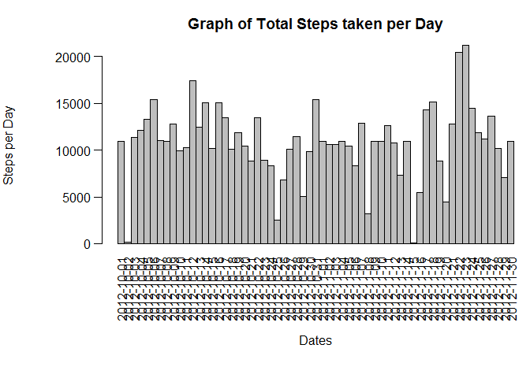

# Reproducible Research: Peer Assessment 1


```r
library(knitr)
opts_chunk$set(echo=TRUE, results = 'hold')
library(lattice)
library(data.table)
```

##Loading and preprocessing the data; 
Get the original data https://d396qusza40orc.cloudfront.net/repdata%2Fdata%2Factivity.zip; unzip file, set working directory to location of file.

Create a place to hold the data downloaded; view header info

```r
rawData <- read.csv('activity.csv') 
head(rawData)
```

```
##   steps       date interval
## 1    NA 2012-10-01        0
## 2    NA 2012-10-01        5
## 3    NA 2012-10-01       10
## 4    NA 2012-10-01       15
## 5    NA 2012-10-01       20
## 6    NA 2012-10-01       25
```

## What is mean total number of steps taken per day?
Create dataset with total number of steps per day; view header

```r
SumStepsDaily <- aggregate(rawData$steps,list(rawData$date),sum)
colnames(SumStepsDaily)<-c("date","steps")
head(SumStepsDaily)
```

```
##         date steps
## 1 2012-10-01    NA
## 2 2012-10-02   126
## 3 2012-10-03 11352
## 4 2012-10-04 12116
## 5 2012-10-05 13294
## 6 2012-10-06 15420
```

histogram of total steps per day

```r
with(SumStepsDaily, {
  par(oma=c(2,0,0,0), mar=c(6.75,6.75,3,0), mgp=c(5.75,0.75,0), las=2)
  barplot(
    height=steps,
    main="Graph of Total Steps taken per Day",
    xlab="Dates",
    ylab="Steps per Day",
    names.arg=date,
    space=c(0)
  )
})
```

 

Calculate & View mean of daily steps:

```r
meanDailySteps <- mean(SumStepsDaily$steps,na.rm=TRUE)
meanDailySteps
```

```
## [1] 10766.19
```

Caluculate & View median of daily steps

```r
medianDailySteps <- median(SumStepsDaily$steps, na.rm=TRUE)
medianDailySteps
```

```
## [1] 10765
```

##What is the average daily activity pattern?


- Make a time series plot (i.e. type = "l") of the 5-minute interval (x-axis) and the average number of steps taken, averaged across all days (y-axis)


Generate the mean (average) number of steps taken (ignoring NA values) for each 5-minute interval, itself averaged across all days.


```r
intervalSteps <- aggregate(
  data=rawData,
  steps~interval,
  FUN=mean,
  na.action=na.omit
)
colnames(intervalSteps) <- c("Interval", "AvgStepsAvgAcrossDay")

head(intervalSteps)
```

```
##   Interval AvgStepsAvgAcrossDay
## 1        0            1.7169811
## 2        5            0.3396226
## 3       10            0.1320755
## 4       15            0.1509434
## 5       20            0.0754717
## 6       25            2.0943396
```

Create a plot


```r
with(intervalSteps, {
    plot(
      x=Interval,
      y=AvgStepsAvgAcrossDay,
      type="l",
      main="Time-Series of Average Steps against Interval",
      xlab="5-minute Interval",
      ylab="Average Steps, Average across all Days"

    )
})
```

 

- Which 5-minute interval, on average across all the days in the dataset, contains the maximum number of steps?

Find max

```r
intervalMax <- intervalSteps[intervalSteps$AvgStepsAvgAcrossDay==max(intervalSteps$AvgStepsAvgAcrossDay),]
```

## Imputing missing values
- Calculate and report the total number of missing values in the dataset (i.e. the total number of rows with NAs)

count number of NA records


```r
countNA <- nrow(subset(rawData, is.na(rawData$steps)))
```

- Devise a strategy for filling in all of the missing values in the dataset. The strategy does not need to be sophisticated. For example, you could use the mean/median for that day, or the mean for that 5 minute interval, etc.

Fill in missing data with mean values

```r
stepValues <- data.frame(rawData$steps)
stepValues[is.na(stepValues),] <- ceiling(tapply(X=rawData$steps,INDEX=rawData$interval,FUN=mean,na.rm=TRUE))
newData <- cbind(stepValues, rawData[,2:3])
colnames(newData) <- c("Steps", "Date", "Interval")
head(newData)
countNA
```

```
##   Steps       Date Interval
## 1     2 2012-10-01        0
## 2     1 2012-10-01        5
## 3     1 2012-10-01       10
## 4     1 2012-10-01       15
## 5     1 2012-10-01       20
## 6     3 2012-10-01       25
## [1] 2304
```

- Create a new dataset that is equal to the original dataset but with the missing data filled in.

Total number of steps per date with NA values filled in


```r
newDailyStepSum <- aggregate(newData$Steps, list(newData$Date), sum)
colnames(newDailyStepSum)<-c("date","steps")
head(newDailyStepSum)
```

```
##         date steps
## 1 2012-10-01 10909
## 2 2012-10-02   126
## 3 2012-10-03 11352
## 4 2012-10-04 12116
## 5 2012-10-05 13294
## 6 2012-10-06 15420
```

- Make a histogram of the total number of steps taken each day and Calculate and report the mean and median total number of steps taken per day. Do these values differ from the estimates from the first part of the assignment? What is the impact of imputing missing data on the estimates of the total daily number of steps?

Graph of total number of steps per day with NA values filled in

```r
with(newDailyStepSum, {
  par(oma=c(2,0,0,0), mar=c(6.75,6.75,3,0), mgp=c(5.75,0.75,0), las=2)
  barplot(
    height=steps,
    main="Graph of Total Steps taken per Day",
    xlab="Dates",
    ylab="Steps per Day",
    names.arg=date,
    space=c(0)
  )
})
```

 

Calculate new mean and median


```r
meannew<- mean(newDailyStepSum$steps)
mediannew <- median(newDailyStepSum$steps)

meannew
mediannew
```

```
## [1] 10784.92
## [1] 10909
```

Compare new mean and median with original
Original Mean: 1.0766189\times 10^{4} compared to 1.0784918\times 10^{4} with NAs filled in.

Original Median: 10765 compared to 1.0909\times 10^{4} with NAs filled in.

## Are there differences in activity patterns between weekdays and weekends?

- Create a new factor variable in the dataset with two levels -- "weekday" and "weekend" indicating whether a given date is a weekday or weekend day.

separated by weekday, weekend


```r
dateDayType <- data.frame(sapply(X = newData$Date, FUN = function(day) {
  if (weekdays(as.Date(day)) %in% c("Monday", "Tuesday", "Wednesday", "Thursday", 
                                    "Friday")) {
    day <- "weekday"
  } else {
    day <- "weekend"
  }
}))

newDataWithDayType <- cbind(newData, dateDayType)

colnames(newDataWithDayType) <- c("Steps", "Date", "Interval", "DayType")

dayTypeIntervalSteps <- aggregate(
       Steps ~ DayType + Interval, data = newDataWithDayType,
       FUN="mean"
   )
head(dayTypeIntervalSteps)
```

```
##   DayType Interval     Steps
## 1 weekday        0 2.2888889
## 2 weekend        0 0.2500000
## 3 weekday        5 0.5333333
## 4 weekend        5 0.1250000
## 5 weekday       10 0.2888889
## 6 weekend       10 0.1250000
```

Plot of weekday and weekend

```r
xyplot(
   type="l",
   data=dayTypeIntervalSteps,
   Steps ~ Interval | DayType,
   xlab="Interval",
   ylab="Number of steps",
   layout=c(1,2)
)
```

 
